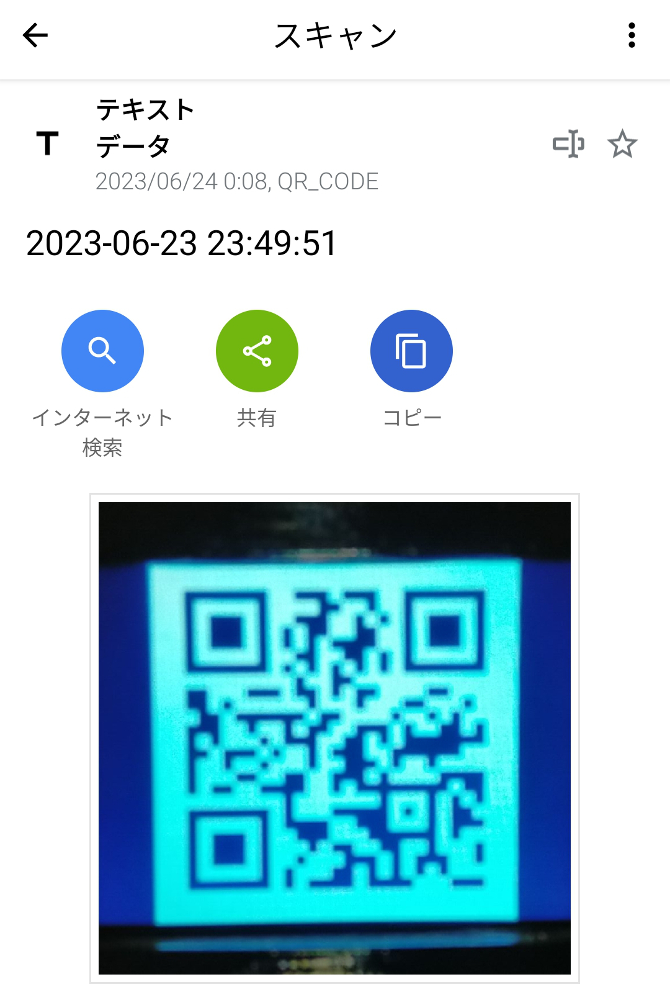
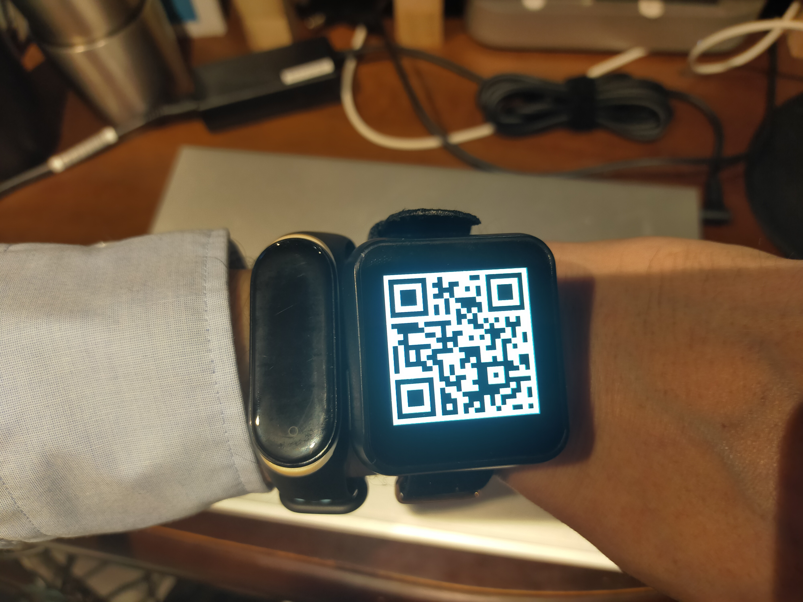

# M5 QRclock

This is the "QR Code Clock" for M5Stack　and TTGO T-Watch

QR code at the current time is updated every second.

## M5Stack

## TTGO T-Watch

## twitter
<blockquote class="twitter-tweet">
M5Unifiedで作り直したので、同一のソースコードで液晶付きのM5Stackシリーズで動きます。githubも更新済。 <a href="https://t.co/QWbRWp2ptK">pic.twitter.com/QWbRWp2ptK</a>
&mdash; tomorrow56(飼猫師)@NT金沢 6/17-18 No.57 (@tomorrow56) <a href="https://twitter.com/tomorrow56/status/1672261892046479363?ref_src=twsrc%5Etfw">June 23, 2023</a></blockquote>

## Special thanks to @Tomy_cn
https://twitter.com/Tomy_cn/status/1671353578324385800?s=20

## Related Link
[M5Stack Official Store](https://shop.m5stack.com/)

[LILYGO Wearable Kit](https://www.lilygo.cc/collections/wearable-kit)
